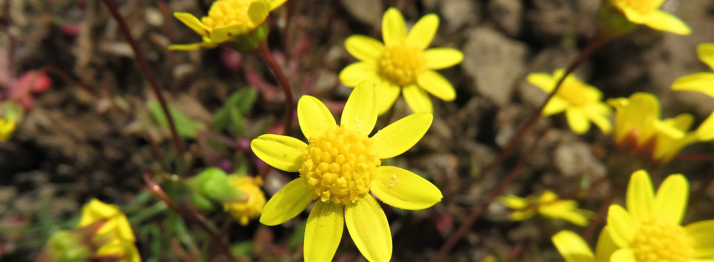

```{r setup, include=FALSE}
knitr::opts_chunk$set(echo = FALSE)
```



## Education
Oregon State University, PhD Candidate/NSF Graduate Research Fellow, September 2017 to present

Colorado State University, *B.S.* Forest Biology & Botany minor, 2015

## Awards & Scholarships
•	National Science Foundation Graduate Research Fellowship, 2019<br>
•	OSU: Hayes Fellowship Fund for Silviculture Options, 2021<br>
•	OSU: College of Forestry Graduate Fellowship, 2021<br>
•	Association of Fire Ecology: Wayne Harrison Memorial Scholarship, 2020<br>
•	OSU: Oregon Lottery Scholarship, 2020<br>
•	OSU: College of Forestry Graduate Fellowship 2020<br>
•	OSU: Forest Ecosystems and Society Catherin G. Bacon Graduate Fellowship, 2020<br>
•	OSU: College of Forestry, Experiential Learning Funding, 2020<br>
•	OSU: College of Forestry Graduate Fellowship, 2017<br>
•	CSU: Honors Scholarship, 2011 to 2015<br>
•	CSU: Presidential Scholarship, 2011 to 2015<br>
•	CSU: Non-Resident Merit Work-Study, 2013 to 2015<br>
•	CSU: Student Development Fund, 2013 & 2014<br>
•	CSU: Crews Family Pingree Park Scholarship, 2013<br>
•	CSU: William (Mike) Fenner '54 Scholarship, 2013<br>
•	Champaign Centennial High School: Cliff Rocks! Scholarship, 2011

## Research & Science Oureach Grants
•	Sigma Xi: Grants in Aid of Research, 2020<br>
•	Maki Foundation: Grant for environmental conservation, 2020<br>
•	OSU: Forestry Graduate-Undergraduate Mentorship Program, 2020<br>
•	Native Plant Society of Oregon: Field Research Grant, 2020<br>
•	OSU: Student Organization Resources for Community Engagement Grant, 2020<br>
•	Association for Fire Ecology: Student Chapter Grant, 2020<br>
•	Association for Fire Ecology: Student Travel, Research, and Educational Experience Grant, 2019<br>
•	OSU: Graduate School International Travel Grant, 2019<br>
•	OSU: College of Forestry Discovery Days Grant, 2019<br>
•	Association for Fire Ecology: Student Travel, Research, and Educational Experience Grant, 2018<br>
•	OSU: Mentored Employment Program, 2018<br>
•	Patagonia Environmental Grant, 2017<br>

## Presentations
### Academic conferences
#### Posters
•	*Ventenata dubia*: Invasion potential and impact on native communities in North America’s Inland Pacific Northwest. Ecology and Management of Alien Plant Invasions (EMAPi) conference, Prague, Czech Republic, 2019 <br>
•	Is a new invasive species, *Ventenata dubia*, altering fire regimes and native plant communities? Western Forestry Graduate Research Symposium, Corvallis, OR, 2018 <br>
•	Is a new invasive species, *Ventenata dubia*, altering fire regimes and native plant communities? International Fire Ecology and Management conference, Missoula, MT, 2018 <br> 

#### Presentations
•	Plant community traits and environmental stress influence invasion resistance. Western Forestry Graduate Research Symposium, Corvallis, OR/virtual, 2021 
•	A novel niche: The invasive annual grass *Ventenata dubia* and relationships to wildfire, environment, and community factors in the Inland Northwest. International	Fire Ecology and Management conference, Tucson, AZ, 2019 <br>
•	Trends in alpine vegetation in Rocky Mountain National Park: Monitoring using the GLORIA Methodology Rocky Mountain Research Symposium. Estes Park, CO, 2017

#### Contributed presentations
•	AGU, virtual, 2020 <br>
•	Weed Science Society of America, Maui, HI, 2020 <br>
•	Ecology and Management of Alien Plant Invasions (EMAPi) conference, Prague, Czech Republic, 2019

### Science Outreach Presentations
•	A new invasive threat to Oregon’s native plant communities, *Ventenata dubia*. Native Plant Society of Oregon monthly chapter meeting, Corvallis, OR (2021) <br>
•	One-Two Punch to Oregon’s Natural Areas: Invasive Plants & Fire. DaVinci Days, Corvallis, OR (2020) <br>
•	*Ventenata dubia* research overview and workshop: Invasion and impacts. USFS Leadership Team Meeting, Bend, OR (2018)<br>
•	Is Anyone Listening? Studying why some frogs have ears and others don’t. Mosquito Range Heritage Initiative Adventure Series, Alma, CO. (2016) <br>
•	Monitoring Alpine Vegetation in the Mosquito Range. Mosquito Range Heritage Initiative Annual Community Meeting. Alma, CO. (2016) 

## Teaching Experience
### Pedagogical Training
•	OSU GRAD 561: Course Design and Methods (3 credits). 2021 <br>
•	Course Co-designer for Forest Ecology (FES 341). 2020 <br>
*Developed course structure, topics, syllabus, learning materials, and activities*<br>
•	OSU GRAD 560: Theories and Practice in College and University Teaching (3 credits). 2019 <br>
•	OSU Center for Teaching and Learning: Collecting Feedback & Responsive Teaching Workshop. 2020

### Graduate Teaching Assistant
•	Forest Ecology (FES 341), OSU, Corvallis, OR. 2018

### Guest Lectures
•	Fire Ecology (FES 440/540), OSU, Corvallis, OR. 2021 <br>
•	Fire Ecology (FES 440/540), OSU, Corvallis, OR. 2020 <br>
•	Forest Ecology (FES 341), OSU, Corvallis, OR. 2018 <br>
•	Wildland Restoration (RNG 521), OSU, Corvallis, OR. 2018

### Workshops & Field Trips
•	USFS post-fire invasive species management workshop, Region 6/virtual. 2021<br>
•	USFS Ventenata dubia and fire field trip, Prineville, OR. 2019<br>
•	USFS Invasive species Listening Sessions:<br>
John Day, OR. 2019<br>
Naches, WA. 2019<br>
Prineville, OR. 2019<br>
Bend, OR. 2018<br>
Prineville, OR. 2017<br>
Lakeview, OR. 2017<br>

## Mentoring Experience
•	Undergraduate Thesis Committee Member, Oregon State University (2019 to present)<br>
**Simone Gibson**. Project: How does Ventenata dubia influence fuel load and fire behavior?<br>

•	Forestry Graduate-Undergraduate Mentorship Program, Oregon State University (2020)<br>
**Haley Weir**. Project: Exploring Oregon's Fire Ecology Through the Lens of Sustainability<br>

•	Undergraduate Mentored Employment Program Mentor, Oregon State University (2018 to 2019)<br>
**Michael Dominguez**. Project: Determining how soils drive the Ventenata dubia invasion.<br>

## Outdoor Educating & Instructing 
•	Mosquito Range Heritage Initiative, Alma, CO. 2016,
*Program Facilitator*<br>
•	CSU University Recreation Center, Fort Collins, CO. 2011 to 2015,           
*Outdoor adventure trip leader/instructor*<br>
•	Exposure Alaska/ MICA Guides, Glacier View, Alaska. Summer 2012 & 2013,               *Glacier trekking and climbing leader/instructor*<br>
•	Camp Ondessonk, Ozark, IL. Summer 2009, 2010, & 2011    
*Summer camp adventure trip leader/nature instructor* <br>

## Field Research Experience
•	Eastern Oregon. OSU University, Summer 2018 to 2020,
*Lead field Researcher* <br>
•	Eastern Oregon. Western Colorado University/ OSU, Jun. to Sep. 2017
*Lead Field Botanist*  <br>
•	Eastern Washington. University of Washington, Apr. to Jun. 2017
*Botany Field Technician * <br>
•	San Vito, Cost Rica. Las Cruces Organization of Tropical Studies, Mar. 2017
*Volunteer Research Assistant * <br>
•	Alma, Colorado. Mosquito Range Heritage Initiative, Jun. to Sep. 2015; Feb. to Dec. 2016,
*Botanist/ Outreach coordinator * <br>
•	Yellowstone, WY, Great Sand Dunes National Parks, CO, & Pecos Wilderness, NM. 
Colorado Natural Heritage Program, Fort Collins, Colorado, 2013 to 2017, <br>
*Botanist/ Data Analyst*. 2017 <br>
*Botany Crew Lead*. Summer 2015 & 2016 <br>
*Botany/ Ecology Intern*. 2013 to 2015<br>
•	Oxapampa, Perú. Centro de Capacitación en Conservación y Desarrollo Sostenible, 2016,
*Volunteer Research Assistant*<br>
•	Denali & Yukon-Charley National Parks, AK. NPS/Central Alaska Network. 2014,
*Botanist: AmeriCorps*<br>
•	Fort Collins, CO. Pilon-Smits Laboratory, Fort Collins, Colorado, 2013 to 2014,
*Undergraduate Lab and Field Research Assistant*

## DEI & Science Outreach Volunteering

### Diversity, Equity, and Inclusion 
•	College of Forestry: DEI in Course Design, 2020 to 2021, *Taskforce Member* <br>
•	Promoting DEI in Seasonal Fieldwork Workshop, 2021, *Participant*<br>
•	Decolonize Fire Ecology Workshop, 2021, *Participant*<br>
•	Adaptive Recreational Opportunities, Fort Collins, Colorado, 2012, *Volunteer instructor*                           

### Science Outreach (Volunteer)
•	Franklin Elementary School Science Night, Corvallis, OR. 2020<br>
•	OSU Discovery Days, Corvallis, OR. 2017, 2019 & 2020 <br>
•	Corvallis Bioblitz, Corvallis, OR. 2019 <br>
•	Linn-Benton Salmon Watch, Corvallis, OR. 2016<br>
•	Sylvan-dale Ranch Bioblitz, Loveland, CO. 2015

## Professional Service
•	OSU Forest Ecosystems & Society Coffee: Organizing Committee, 2021<br>
•	OSU College of Forestry: Diversity, Equity, and Inclusion Task Force, 2020 to 2021<br>
•	Western Forestry Graduate Research Symposium: Organizing Committee, 2019, 2020, 2021<br>
•	Student Association of Fire Ecology: Treasurer, 2017 to 2020<br>
•	OSU Forest Ecosystems & Society: Graduate Student Faculty Awards Committee, 2020<br>
•	OSU Forest Ecosystems & Society: Faculty Promotion Review Student Committee Chair, 2019<br>

•	**Journal Reviews**: Ecological Monographs (1), Rangeland Ecology & Management (2), USGS Annotated Bibliography (1)

## Certifications
•	Wilderness First Responder & CPR (SOLO) | through April 2024


