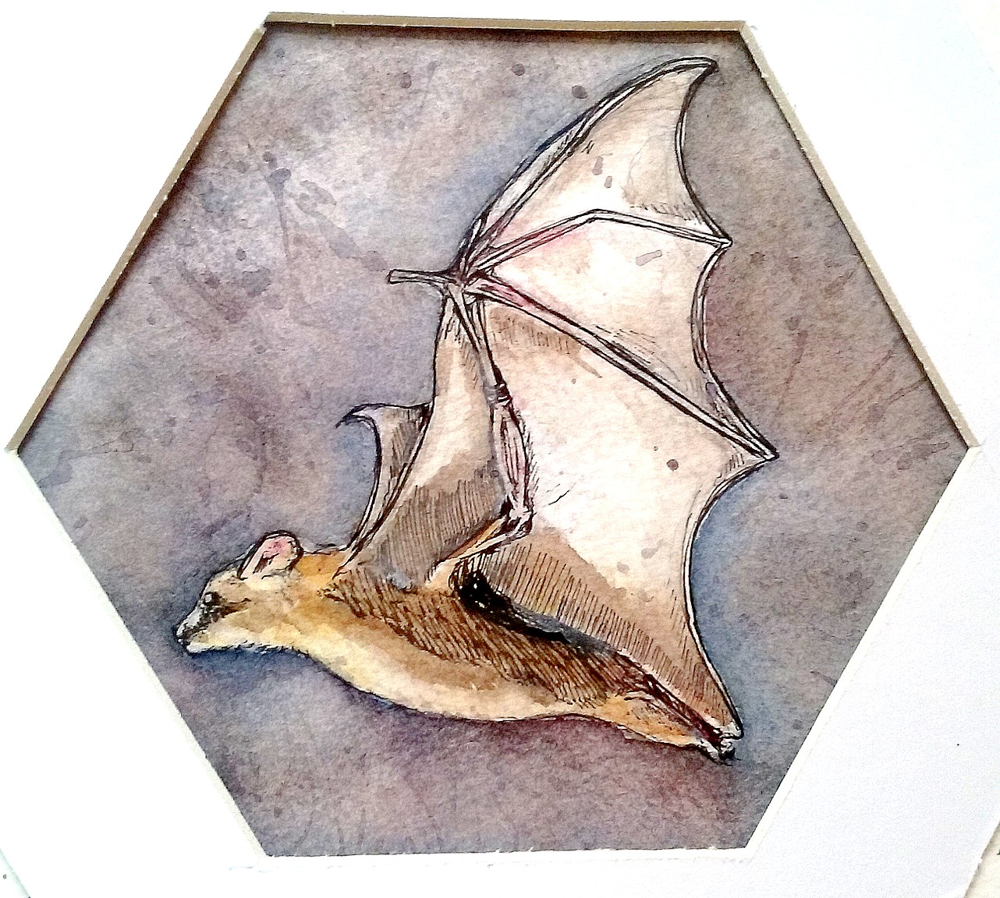
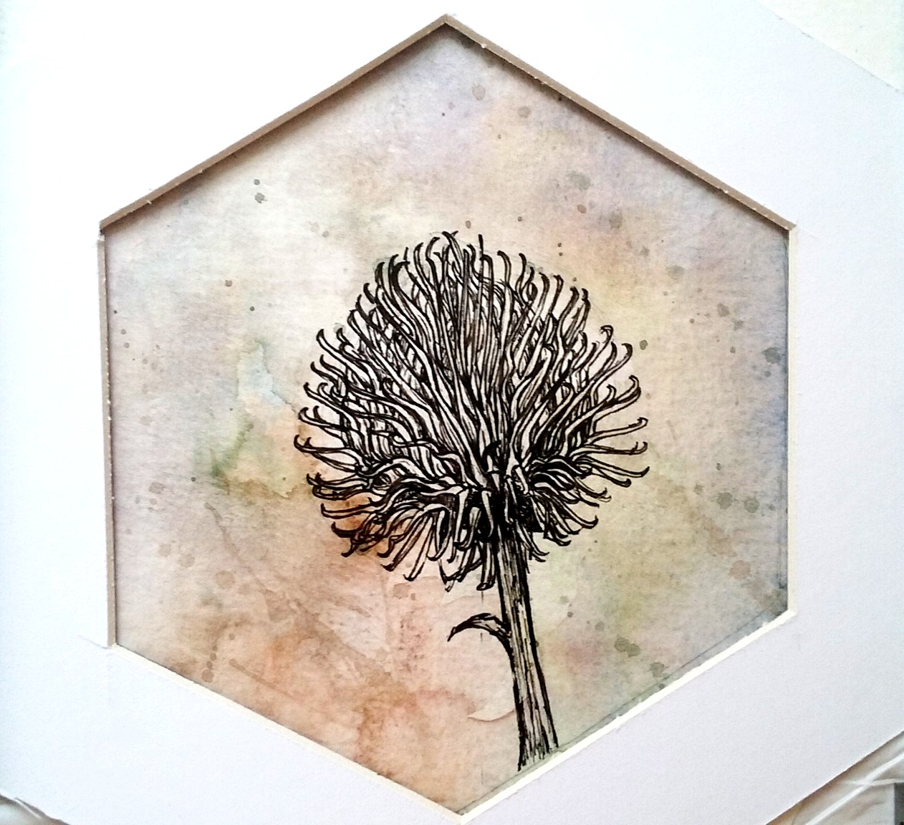
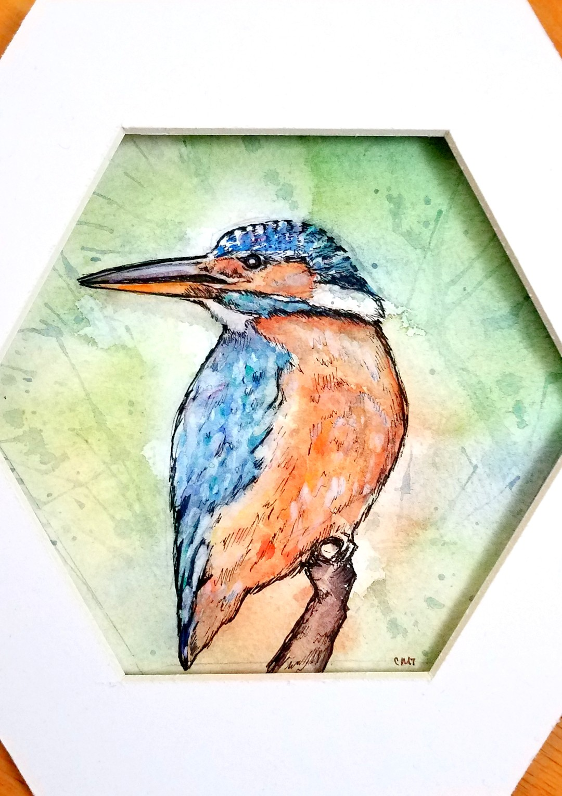
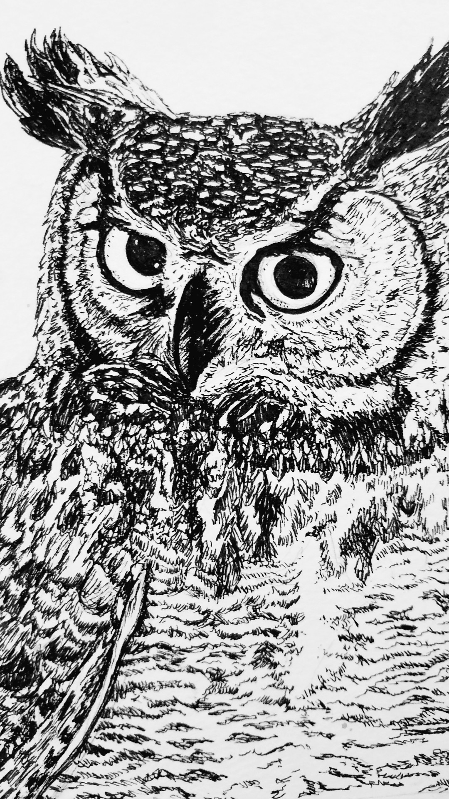
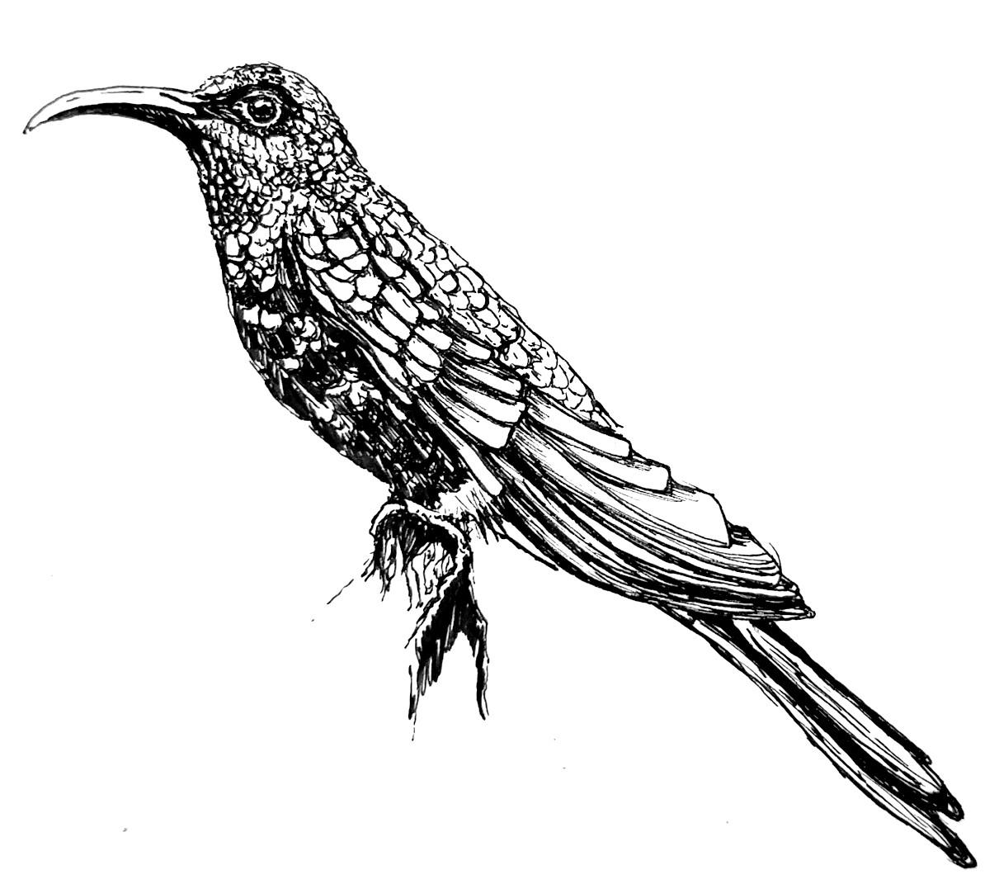
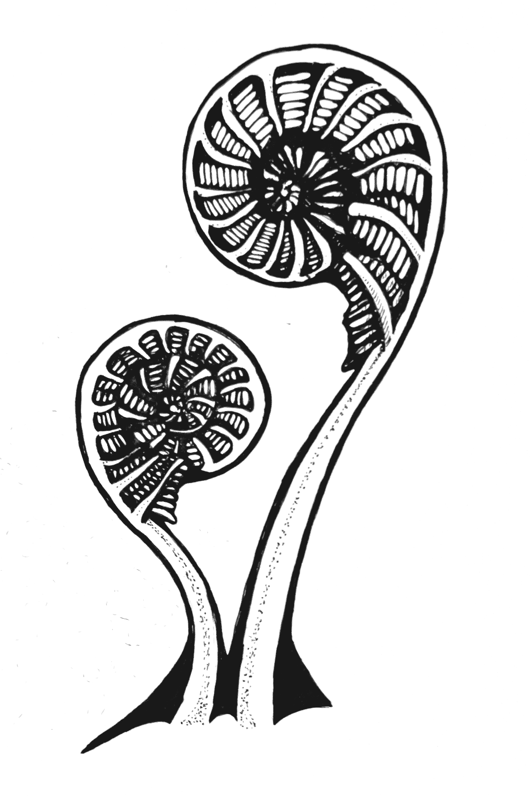
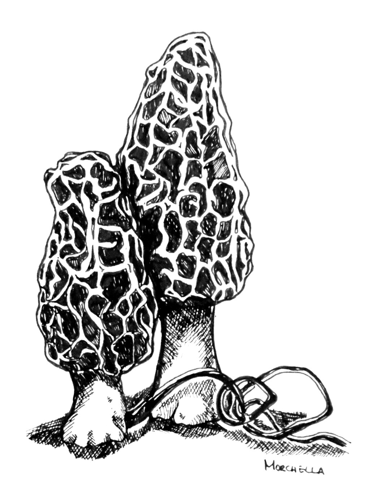
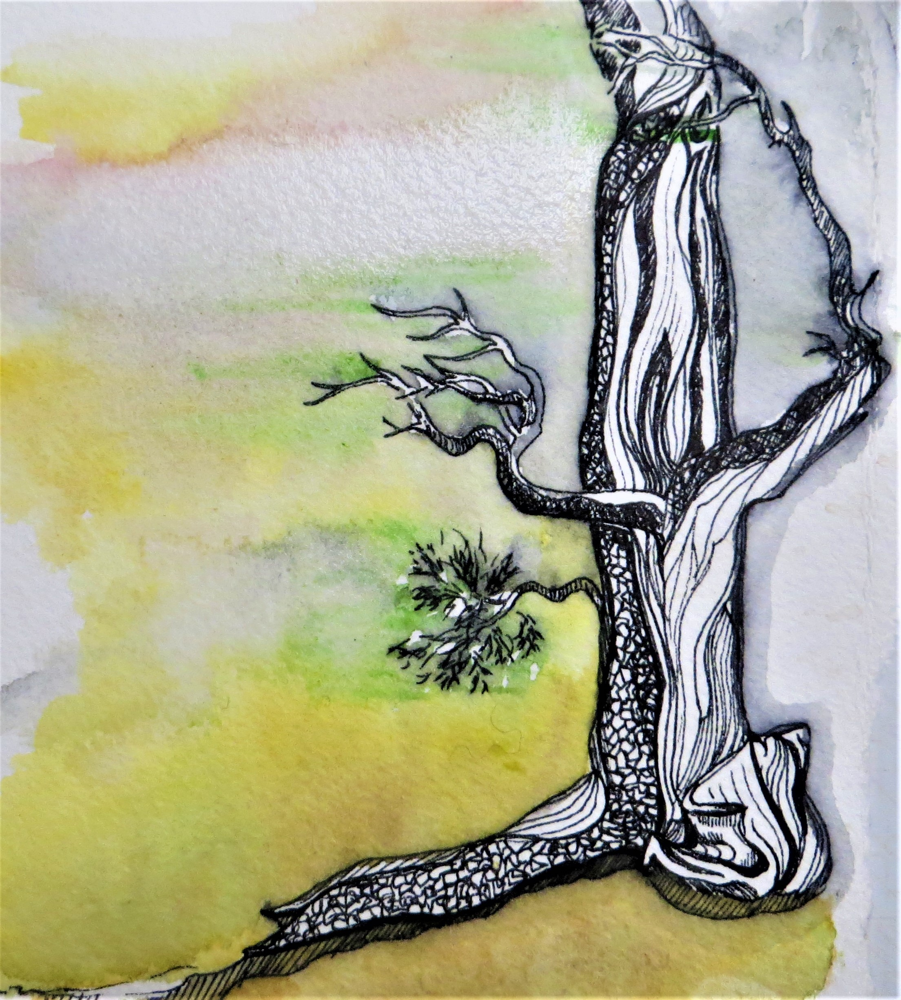

```{r setup, include=FALSE}
knitr::opts_chunk$set(echo = FALSE)
```
{ width=50%}


<br/>
Great blue heron, *Ardea herodias*
<br/>


{ width=34% } 
{ width=34% } 
{ width=28% } 
<br/>


{ width=45% }
{ width=45% } 
<br/>
American Goldfinch, *Spinus tristis*; Great horned owl, *Bubo virginianus*


<br/>
{ width=45% } 
{ width=45% } 

<br/>
violet sabrewing, *Campylopterus hemileucurus*; green hermit, *Phaethornis guy*    

<br/>

{ width=40% } 
{ width=40% } 
<br/>
Fiddlehead ferns; *Morchella*


{ width=45% } 
{ width=45% } 

<br/>
*Echinacea purpurea*; Bristlecone pine, *Pinus aristata* 

