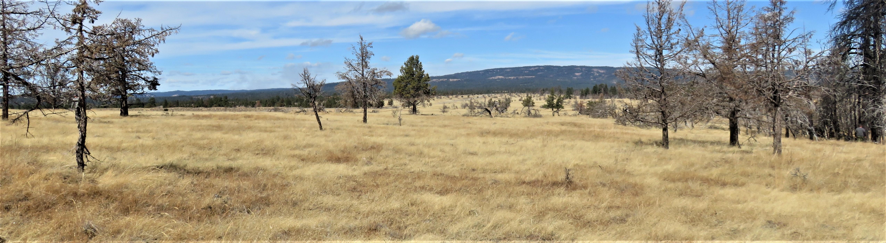

```{r setup, include=FALSE}
knitr::opts_chunk$set(echo = FALSE)
```



## Drivers of Reburn Severity - California forests

Changes in climate and fuels have promoted an increase in forested area that has burned multiple times in a relativity short time period. This increase in reburned area affords us the opportunity to ask how past fires in forests may help mitigate or exacerbate future fire effects. Understanding how wildfires influence future fires may help managers utilize these burned areas in future fire planning efforts.  

At UC Davis, I am working with Drs. Andrew Latimer and Derek Young to investigate the drivers of reburn severity and predict areas where past fires may help reduce future fire severity to inform management actions using remotely sensed data and field observations. 

## Post-fire forest recovery - California forests

The amount of forested land burning in severe fire is increasing at an alarming rate. Forest recovery after severe fire is a top management concern, given that many of these areas appear to have undergone transitions from forest to non-forest shrubland or grassland following severe fire. However, many post-fire regeneration surveys occur < 5 years following fire, and these conditions may not accurately predict how forests are recovering in the long term. 

Working with a team at UC Davis, I am using long-term post-fire monitoring data to investigate how forests are recovering after fire over time, and what factors may be influencing this recovery. How well do regeneration and site conditions shortly after fire predict longer term recovery patterns?


## Wildfire and Plant Invasions - Intermountain West

Invasion by non-native grasses are particularly impactful when they alter fire regimes and promote fire in historically fire-resistant areas, resulting in the loss of plant species that do not recover quickly after burning. 

I use field data, remote sensing, and fire simulations to examine how plant invasions respond to and alter fire and post-fire plant communities and forest recovery at local and landscape scales. 

