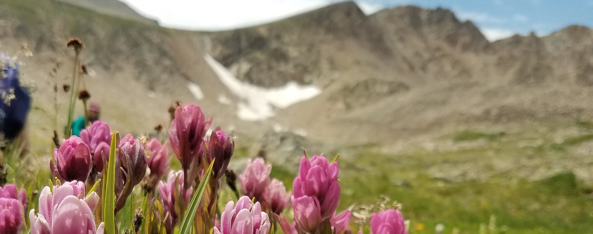

```{r setup, include=FALSE}
knitr::opts_chunk$set(echo = FALSE)
```



The alpine contains an amazing amount of diversity, but many of these species may become threatened as global temperatures rise leaving these mountain-top species no where to go. 

I am interested in how climate change is influencing alpine plant communities across the planet: 

Are lower elevations species moving up? If so, where? How are long-lived species affected differently than short lived species? What climate factors contribute the most to community change (extreme high/low temperatures; changes in number of growing degree days; snow pack)?

To investigate how alpine communities are affected by the changing climate, I have sampled alpine plant communities from 19 monitoring plots in 4 states across Western North America as part of the Global Observation Research Initiative in Alpine Environments long term monitoring effort (https://www.gloria.ac.at/). Sampling occurs in 5 year intervals and many sites are now in their 2nd or 3rd sampling. 