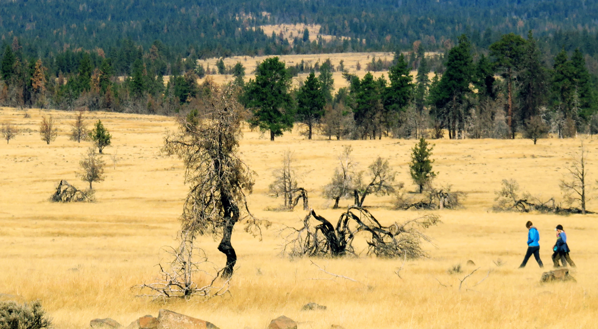
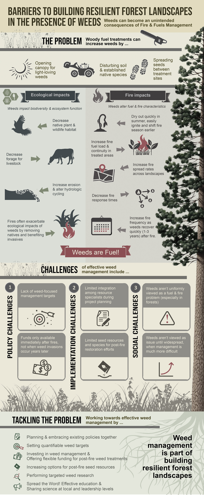

```{r setup, include=FALSE}
knitr::opts_chunk$set(echo = TRUE)
```




## Co-produced Research

I work closely with land managers throughout the question development, research, and science delivery processes to co-produce actionable research on relevant topics regarding the resistance and resilience of western rangelands and forests. <br>

Current co-production projects include (1) understanding the response of the annual grass invader *Ventenata dubia* as well as other pervasive annual grass invaders to wildfire and perscribed buring in western forests and rangelands. See more about our ventenata work on [our site](https://www.nwfirescience.org/ventenata) <br>
(2) Investigating trade-offs of fuel reduction treatments in juniper and dry mixed conifer forests for ecological function, invasion, fine fuel loads, and future fire at multiple spatial and temporal scales. We worked closely with fire and vegetation managers from across the Northwest to develop the infographic below and address issues surrounding both fuels and invasive species management <br>
(3) Examining how well short-term forest recovery data and management actions following severe wildfire reflect long-term vegetation outcomes to inform post-fire management. <br>
(4) Understanding the role of multiple disturbances (e.g invasion, drought, and fire) in influencing post-fire forest recovery in CA forests to inform pre- and post-fire management in previously disturbed areas. 


