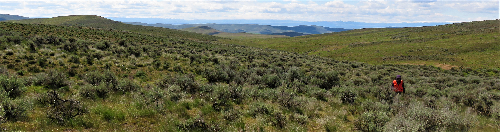

```{r setup, include=FALSE}
knitr::opts_chunk$set(echo = FALSE)
```


### Submitted/ in review
**Tortorelli, C.**, Kim, J., Vaillant, N., Riley, K., Dye, A., Nietupski, TC., Vogler, KC., Lemons, R., Day, M., Krawchuk, M., Kerns, BK. **Feeding the fire: annual grass invasion facilitates modeled fire spread across Inland Northwest forest-mosaic landscapes**.

<sup>1</sup>Luedloff, E., **Tortorelli, C.**, Luoma, D., Krawchuk, M. **Getting to the Root of It: Root Colonization by Fungal Symbionts in the Invasive Grass Ventenata dubia**.

<sup>1</sup>indicates undergraduate co-author

### 2022
**Tortorelli, C.**, Kerns, B. K., Krawchuk, M. (2022) **Community invasion resistance is influenced by interactions between plant traits and site productivity**. [Ecology: e3697](https://doi.org/10.1002/ecy.3697)

**Tortorelli, C.**, Kerns, B. K., Krawchuk, M. (2022) **The invasive annual grass *Ventenata dubia* is insensitive to experimental removal of above-ground resident biomass across a productivity gradient**. [Biological Invasions](https://link.springer.com/article/10.1007/s10530-022-02823-5)

### 2020
**Tortorelli, C.**, Kerns, B. K., Krawchuk, M. (2020). **Expanding the invasion footprint: *Ventenata dubia* and relationships to wildfire, environment, and plant communities in the Inland Northwest, USA.** [Applied Vegetation Science: 23.4: 562-574](https://www.fs.usda.gov/treesearch/pubs/60889)

Kerns, B. K., **Tortorelli, C.**, Day, M., Nietupski, T., Barros, A. M.G., Kim, J., Krawchuk, M. (2020). **Invasive grasses: A new perfect storm for forested ecosystems?** [Forest Ecosystems and Management, 463(1)](https://www.fs.usda.gov/treesearch/pubs/59939)

Downing, W. M., Krawchuk, M. A., Coop, J. D., Meigs, G. W., Haire, S. L., Walker, R. B., ... & **Tortorelli, C.** (2020). **How do plant communities differ between fire refugia and fire‐generated early‐seral vegetation?** [Journal of Vegetation Science, 31(1), 26-39](https://onlinelibrary.wiley.com/doi/abs/10.1111/jvs.12814?af=R)

### 2017
**Tortorelli, C.**, D. Gannon, J. Stynoski, F. Trama. (2017). *Rhinella Yunga* Predation. Herpetological Review.

## Monitoring Reports

**Tortorelli, C.** and Others. 2019. Alpine vegetation and soils monitoring in Great Sand Dunes National Park and Preserve: 2010–2015 data report. Natural Resource Data Series. [NPS/ROMN/NRDS—2019/1229](https://irma.nps.gov/DataStore/DownloadFile/628272). National Park Service. Fort Collins, Colorado

**Tortorelli, C.** and Others. 2019. Alpine vegetation and soils monitoring in Yellowstone National Park: 2011–2016 data report. Natural Resource Data Series. [NPS/ROMN/NRDS—2019/1233](https://irma.nps.gov/DataStore/DownloadFile/628782). National Park Service. Fort Collins, Colorado
