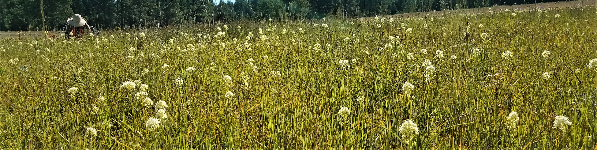

```{r setup, include=FALSE}
knitr::opts_chunk$set(echo = FALSE)
```



Native plant communities across the globe are threatened by introduced species that compete for resources and alter ecosystem functions. Environmental and biotic characteristics  of a community can influence the success of an invading species. Productive communities are often thought to be more resistant to invasion because they more completely utilize available resources. Species with similar traits to invaders are also thought to increase community resistance by having greater niche overlap and competing more strongly for limited resources than dissimilar species. However, the strength of resistance may depend on the environmental characteristics of the community as well as community functional traits. Additionally, disturbances such as fire may increase available resources and remove native competitors, potentially exacerbating invasion impacts. Understanding how community traits, environmental stress, and disturbance interact to influence invasion resistance is important for predicting and managing potential impacts associated with introduced species.

My dissertation research, with Dr. Meg Krawchuk & Dr. Becky Kerns, examines how community traits, abiotic stress, and disturbance interact to influence invasion resistance in dry forest-mosaic landscapes using short and long-term field observations and data from field experiments. 

### Research Questions

We ask: (1) How do biotic community factors such as productivity, diversity, and above/below-ground functional traits influence invasion resistance? <br>
(2) How are resident-invader interactions influenced by environmental condition (such as resource availability) and disturbances (fire)?


### Ventenata

In eastern Oregon, a recently introduced Eurasian annual grass, *Ventenata dubia* (commonly known as ventenata), is spreading rapidly across dry forests, meadows, and shrublands. Prior to the ventenata invasion, many of these communities remained resistant to invasion despite being exposed to numerous impactful introduced species including cheatgrass, *Bromus tectorum*. Little is known about ventenata’s impacts on native plant communities, but its invasion into rare and previously uninvaded ecosystems is cause for alarm. Improving understanding of how environmental and plant community characteristics influence resistance to invasion could aid the development of adaptive management and restoration strategies. 


